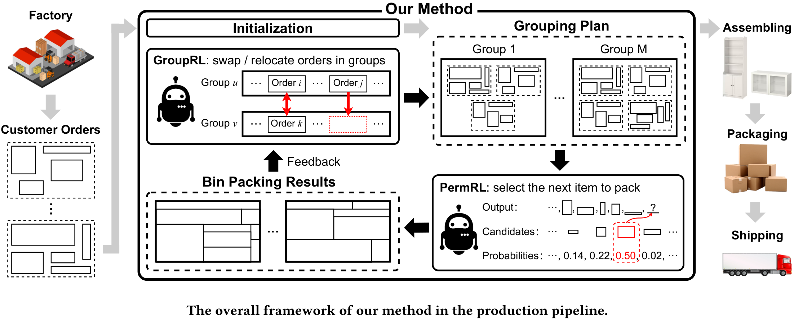
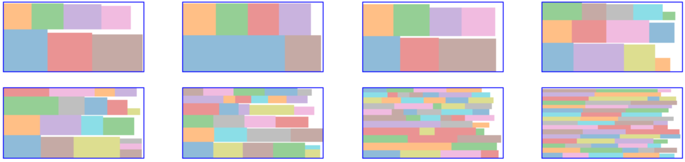

# Learning to Solve Grouped 2D Bin Packing Problems in Manufacturing Industry

This repo contains the source code and datasets for our [KDD'23 paper](https://dl.acm.org/doi/pdf/10.1145/3580305.3599860).



Please cite us as:
```bibtex
@inproceedings{Ao2023,
  doi = {10.1145/3580305.3599860},
  url = {https://doi.org/10.1145/3580305.3599860},
  year = {2023},
  month = aug,
  publisher = {{ACM}},
  author = {Wenxuan Ao and Guozhen Zhang and Yong Li and Depeng Jin},
  title = {Learning to Solve Grouped 2D Bin Packing Problems in the Manufacturing Industry},
  booktitle = {Proceedings of the 29th {ACM} {SIGKDD} Conference on Knowledge Discovery and Data Mining}
}
```

## Requirements

```
python>=3.8
einops==0.6.0
numpy==1.21.2
ray==1.10.0
scipy==1.7.3
setproctitle==1.2.3
torch==1.13.0
tqdm==4.62.3
```

And install `pybp` by running
```bash
pip install git+https://github.com/John-Ao/pybp
```

## Datasets
The training set and testing set of the synthetic datasets `G200` and `G100` are in the `./dataset` folder. Due to privacy concerns, the `Real` dataset is not included. Instead, the synthetic dataset `G200` can be used, which is generated with statistics similar to `Real`.

Let's recap the key definitions of the Grouped 2D bin packing problem are as follows:

* **Bin**: we refer to the raw material sheets as bins, which are rectangular and all of the same size. We denote the width as $W$ and height as $H$.
* **Item**: we refer to the parts or panels that need to be cut from bins as items, which are also rectangular but with different sizes.
* **Order**: an customer order contains a list of items. The items in the same order must be manufactured together.
* **Group**: a group is a list of orders. The group is the basic unit of manufacturing. As the items need to be sorted out for the assembly of each order after manufacturing, there is a limit on the maximum number of items a group contains.
* **Bin packing plan**: it is a way to arrange and fit the given list of items on a list of bins such that the edges of the items are parallel to the edges of the bins and the items do not overlap.
* **Grouping plan**: it is a way to partition the given list of orders
into several groups.


In the datasets, the dimensions of the bin are $W=2440mm$ and $H=1220mm$. For `G200`, the maximum number of items in a group is $200$ and for `G100` it is $100$.

The datasets are provided as 3-dimensional lists. The first dimension is day, the second is customer order, the third is item (represented as **width x height**), as shown in the following example:
```python
[
  # Day 0
  [
    # Customer order 0
    [
      [1,1], # item 0, size is 1x1
      [2,2], # item 1, size is 2x2
    ],
    # Customer order 1
    [
      [3,5], # item 2, size is 3x5
      [6,7], # item 3, size is 6x7
      [8,9], # item 4, size is 8x9
    ],
    ...
  ],
  # Day 1
  [
    ...
  ],
  ...
]
```

## Baselines
The baseline methods can be run with `run_baseline.py`.

For example, to test `GGA-H` on the first instance of dataset `G100`, use
```bash
python run_baseline.py --upper GGA --lower height --dataset G100 --instance 0
```

## Our method
To train the lower agent on `G200` and `G100`, use
```bash
python train_lower.py --dataset G200 --embed-dim 32 --num-heads 4 --pomo 10 --cuda 0
python train_lower.py --dataset G100 --embed-dim 32 --num-heads 4 --pomo 10 --cuda 0
```

To train the upper agent on `G200` and `G100`, use
```bash
python train_upper.py --dataset G200 --lower RL --embed-dim 32 --cuda 0
python train_upper.py --dataset G100 --lower RL --embed-dim 32 --cuda 0
```

We provide checkpoints for pre-trained models on `G200` and `G100`. 
To test our method on the first 10 test instances of dataset `G100` and `G200`, use
```bash
python run_ours.py --dataset G100 --lower RL --steps 1000 --cuda 0
python run_ours.py --dataset G200 --lower RL --steps 1000 --cuda 0
```

## Demo

To see our method in action, please refer to [demo.ipynb](./demo.ipynb), where we demonstrate how to generate the grouping plan and bin packing plans.

